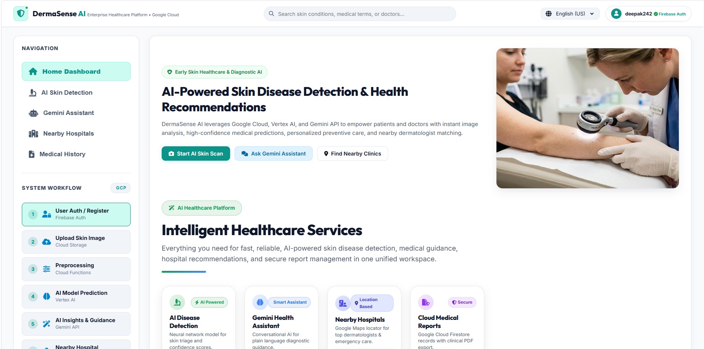
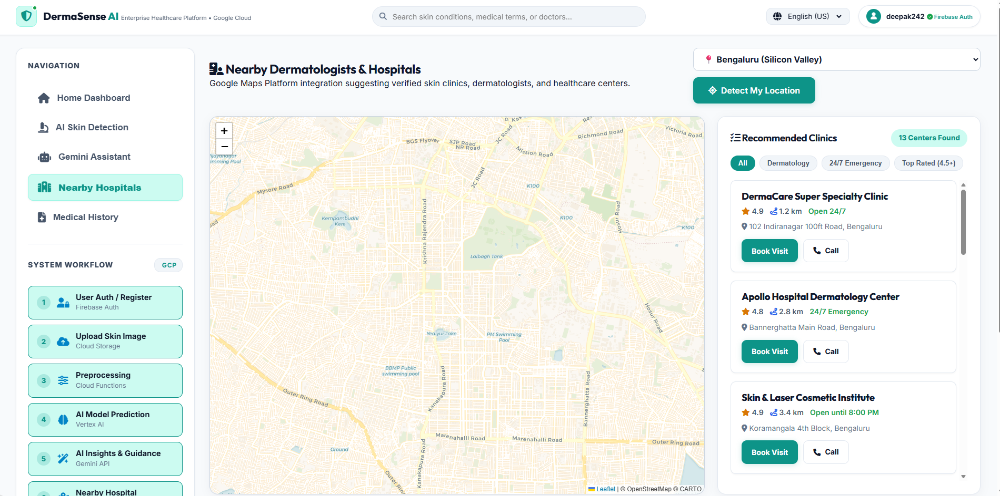
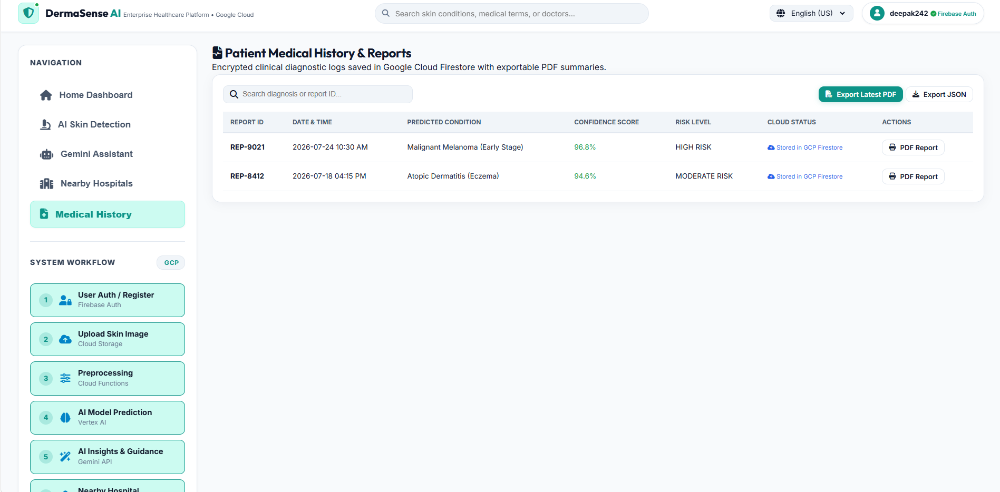
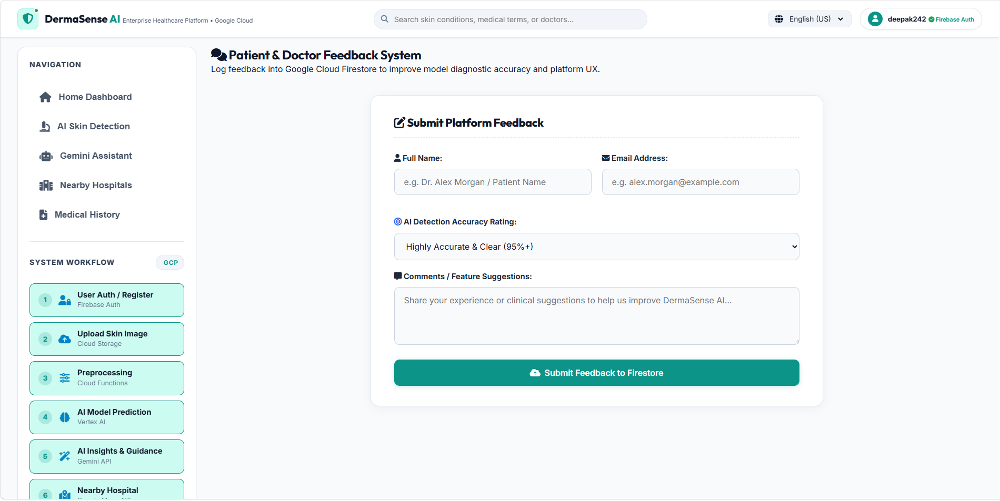

# 🩺 DermaSense AI

> 🏆 **4th Place – Google Cloud HackSprint 2.0 (Digital Campus 2.0)**

DermaSense AI is an AI-powered healthcare platform developed during **Google Cloud HackSprint 2.0** to assist users with early skin disease detection and intelligent healthcare guidance. The platform integrates **Google Cloud Vertex AI, Gemini API, Firebase, Cloud Firestore, Cloud Storage, Cloud Functions, and Google Maps Platform** to deliver AI-assisted diagnosis, personalized healthcare recommendations, secure medical record management, and nearby dermatologist discovery.

---

# 🚀 Key Features

### 🔬 AI Skin Disease Detection
- Upload skin images for AI-assisted disease detection.
- Vertex AI-powered diagnosis with confidence score.
- AI-generated condition overview and healthcare recommendations.
- Personalized precautions, Do's & Don'ts, and treatment guidance.
- Downloadable PDF clinical reports.

### 🤖 Gemini AI Healthcare Assistant
- AI-powered medical guidance using Gemini API.
- Explains detected conditions in simple language.
- Provides personalized healthcare recommendations.

### 🏥 Nearby Dermatologists & Hospitals
- Live location detection.
- Google Maps-based dermatologist and hospital recommendations.
- Distance, ratings, availability, and quick navigation support.

### 📄 Medical History
- Secure storage of diagnostic history in Cloud Firestore.
- Searchable patient history.
- PDF and JSON export support.

### 🔐 Secure Authentication
- Firebase Authentication for secure login.
- Personalized user workspace.

### 💬 Feedback Module
- User feedback collection.
- Secure feedback storage in Cloud Firestore.

---

# 🛠️ Tech Stack

## Frontend
- HTML5
- CSS3
- JavaScript

## Backend
- Node.js
- Express.js

## AI Services
- Google Cloud Vertex AI
- Gemini API

## Google Cloud & Firebase
- Firebase Authentication
- Cloud Firestore
- Cloud Storage
- Cloud Functions

## Maps
- Google Maps Platform
- Leaflet.js

---

# 📸 Application Screenshots

## 🏠 Home Dashboard

Centralized healthcare dashboard providing access to AI diagnosis, Gemini Assistant, Nearby Hospitals, Medical History, and user workflow.

---

## 🔬 AI Skin Disease Detection

Upload a skin image to receive AI-powered diagnosis, confidence score, disease overview, personalized healthcare guidance, and downloadable PDF reports.

---

## 🏥 Nearby Dermatologists & Hospitals

Integrated Google Maps interface recommending nearby dermatologists and hospitals based on user location.

---

## 📄 Medical History

Secure cloud-based storage of diagnostic history with PDF and JSON export functionality.

---

## 💬 User Feedback

Feedback collection module securely storing user responses in Cloud Firestore.

---

# ⚙️ System Workflow

1. User Authentication (Firebase Authentication)
2. Skin Image Upload (Cloud Storage)
3. Image Preprocessing (Cloud Functions)
4. AI Disease Prediction (Vertex AI)
5. AI Healthcare Guidance (Gemini API)
6. Nearby Hospital Recommendation (Google Maps Platform)
7. Medical Report Storage (Cloud Firestore)
8. User Feedback Management

---

# 👨‍💻 My Contributions

As **Team Leader**, I contributed to:

- Designed the overall system architecture and application workflow.
- Developed responsive frontend interfaces using HTML, CSS, and JavaScript.
- Integrated Vertex AI for AI-assisted skin disease prediction.
- Integrated Gemini API for personalized healthcare guidance.
- Implemented Firebase Authentication and Cloud Firestore modules.
- Developed medical history, PDF report generation, and feedback management features.
- Coordinated task allocation, feature integration, and final project presentation during the hackathon.

> **Note:** Update this section to reflect only the work you personally completed.

---

# 🏆 Hackathon Achievement

**Google Cloud HackSprint 2.0 – Digital Campus 2.0**

- 🥉 Secured **4th Place** among participating student teams.
- Developed an end-to-end AI-powered healthcare platform within a **one-day hackathon**.
- Recognized for innovation, cloud integration, and practical healthcare application.

---

# 🚀 Future Enhancements

- Multi-disease prediction support.
- Doctor dashboard.
- Appointment booking system.
- Electronic Health Record (EHR) integration.
- Mobile application.
- Real-time AI chatbot for continuous healthcare assistance.